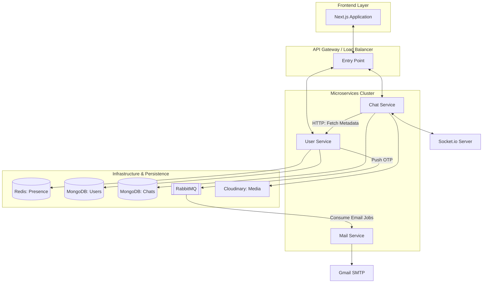

# 🚀 Scalable Microservices Chat System

A high-performance, real-time chat application built with a modern microservices architecture. This system is designed for scalability, featuring asynchronous communication, distributed caching, and real-time synchronization.

---

## 🏗️ System Architecture

The application is decomposed into several specialized microservices, each responsible for a specific domain. Communication between services is handled via **RabbitMQ** for asynchronous tasks and **REST/Sockets** for real-time interactions.

### 📐 High-Level Design (HLD)



---

## 🛠️ Tech Stack

- **Frontend**: [Next.js](https://nextjs.org/), React, Tailwind CSS, Lucide Icons.
- **Backend**: Node.js, [Express.js](https://expressjs.com/), TypeScript.
- **Real-time**: [Socket.io](https://socket.io/) for bidirectional event-based communication.
- **Messaging/Task Queue**: [RabbitMQ](https://www.rabbitmq.com/) for reliable, asynchronous job processing.
- **Caching & Session**: [Redis](https://redis.io/) for user presence and high-speed data access.
- **Database**: [MongoDB](https://www.mongodb.com/) with Mongoose ODM for flexible document storage.
- **Storage**: Cloudinary for optimized media and file delivery.
- **Authentication**: JWT (JSON Web Tokens) for secure, stateless authorization.

---

## 📦 Microservices Breakdown

### 👤 User Service
- **Responsibility**: User authentication, registration, profile management, and session tracking.
- **Key Feature**: Implements **JWT-based auth** and uses **Redis** to track active user presence.
- **Async Pattern**: Produces messages to the `send-otp` queue for email verification.

### 💬 Chat Service
- **Responsibility**: Real-time message delivery, chat history, and media attachments.
- **Key Feature**: Leverages **Socket.io** for millisecond-latency communication and **Multer/Cloudinary** for seamless file uploads.
- **Storage**: Persistence of messages in MongoDB for offline retrieval.

### 📧 Mail Service
- **Responsibility**: Handling all outgoing communications.
- **Key Feature**: A dedicated **RabbitMQ consumer** that processes email jobs asynchronously, ensuring the main application remains responsive even under high load.

---

## 🚀 Key Technical Features

1.  **Distributed Architecture**: Decoupled services allow for independent scaling and deployment.
2.  **Asynchronous Background Tasks**: Heavy tasks like sending emails are offloaded to background workers using RabbitMQ.
3.  **Real-time Synchronization**: Socket.io provides an "always-connected" experience for instant message delivery.
4.  **Optimized Media Delivery**: Integrated with Cloudinary for automated image optimization and CDN delivery.
5.  **Type Safety**: TypeScript is used across the entire stack for robust, maintainable code.

---

## 🛠️ Getting Started

### Prerequisites
- Node.js (v18+)
- MongoDB
- RabbitMQ
- Redis
- Cloudinary Account

### Installation

1.  **Clone the Repository**:
    ```bash
    git clone https://github.com/Vivekveer31/scalable-chat-system.git
    cd scalable-chat-system
    ```

2.  **Setup Environment Variables**:
    Each service requires a `.env` file. Refer to the directory structures to find individual setup guides.

3.  **Install Dependencies & Start Services**:
    ```bash
    # For each service (user, chat, mail, frontend):
    npm install
    npm run dev
    ```

---

## 📈 Future Scaling Path
- **Kubernetes (K8s) Orchestration**: Deploying containers with auto-scaling based on traffic.
- **Redis Pub/Sub**: Scaling Socket.io horizontally across multiple server instances.
- **GraphQL Gateway**: Implementing a unified API entry point for all microservices.

---

## 👨‍💻 Author
**Vivek** - [GitHub](https://github.com/Vivekveer31)

---
